# MANUAL TÉCNICO
## Kick's Store - Plataforma E-commerce

---

**Versión:** 1.0.0
**Fecha:** Noviembre 2025
**Audiencia:** Desarrolladores, Administradores de Sistemas, DevOps
**Stack:** Astro 5.7.13 + Supabase + Vercel + TypeScript

---

<div style="page-break-after: always;"></div>

## TABLA DE CONTENIDO

1. [Introducción Técnica](#1-introducción-técnica)
2. [Arquitectura del Sistema](#2-arquitectura-del-sistema)
3. [Tecnologías y Dependencias](#3-tecnologías-y-dependencias)
4. [Instalación y Configuración](#4-instalación-y-configuración)
5. [Estructura del Proyecto](#5-estructura-del-proyecto)
6. [Base de Datos (Supabase)](#6-base-de-datos-supabase)
7. [API Endpoints](#7-api-endpoints)
8. [Autenticación y Autorización](#8-autenticación-y-autorización)
9. [Frontend y Componentes](#9-frontend-y-componentes)
10. [Despliegue y DevOps](#10-despliegue-y-devops)
11. [Seguridad](#11-seguridad)
12. [Monitoreo y Logging](#12-monitoreo-y-logging)
13. [Mantenimiento y Operación](#13-mantenimiento-y-operación)
14. [Troubleshooting](#14-troubleshooting)
15. [Guías de Desarrollo](#15-guías-de-desarrollo)
16. [Apéndices](#16-apéndices)

---

<div style="page-break-after: always;"></div>

## 1. INTRODUCCIÓN TÉCNICA

### 1.1 Descripción General

**Kick's Store** es una aplicación web de comercio electrónico construida con:

- **Framework:** Astro 5.7.13 (SSR)
- **Backend:** Supabase (PostgreSQL + Auth + Storage)
- **Hosting:** Vercel (Serverless Functions + Edge Network)
- **Lenguajes:** TypeScript, JavaScript, Astro Components
- **Estilos:** Tailwind CSS v4

### 1.2 Características Principales

| Funcionalidad | Tecnología |
|---------------|------------|
| **Renderizado** | SSR (Server-Side Rendering) con Astro |
| **Autenticación** | Supabase Auth (JWT + Cookie-based) |
| **Base de Datos** | PostgreSQL vía Supabase |
| **Storage** | Vercel Blob (avatares) |
| **Emails** | Nodemailer (configurado pero no implementado) |
| **Animaciones** | GSAP + Lenis (smooth scrolling) |
| **Analytics** | Vercel Analytics |

### 1.3 Arquitectura de Alto Nivel

```
┌─────────────────────────────────────────────────────────────┐
│                        USUARIO FINAL                        │
└────────────────────────┬────────────────────────────────────┘
                         │
                         ▼
┌─────────────────────────────────────────────────────────────┐
│                    VERCEL EDGE NETWORK                      │
│                    (CDN + Edge Functions)                   │
└────────────────────────┬────────────────────────────────────┘
                         │
                         ▼
┌─────────────────────────────────────────────────────────────┐
│                    ASTRO SSR SERVER                         │
│  ┌──────────────┐  ┌──────────────┐  ┌──────────────┐     │
│  │   Pages      │  │  Components  │  │  API Routes  │     │
│  │   (.astro)   │  │   (.astro)   │  │    (.ts)     │     │
│  └──────────────┘  └──────────────┘  └──────────────┘     │
└───────┬──────────────────────────────────────┬─────────────┘
        │                                       │
        ▼                                       ▼
┌─────────────────────┐           ┌────────────────────────┐
│   SUPABASE          │           │   VERCEL BLOB          │
│  ┌──────────────┐   │           │  ┌──────────────────┐  │
│  │ PostgreSQL   │   │           │  │ Avatar Storage   │  │
│  │ (7 tablas)   │   │           │  │    (WebP)        │  │
│  └──────────────┘   │           │  └──────────────────┘  │
│  ┌──────────────┐   │           └────────────────────────┘
│  │  Auth (JWT)  │   │
│  └──────────────┘   │
└─────────────────────┘
```

### 1.4 Flujo de Datos

```
1. Cliente → Request → Vercel Edge
2. Vercel Edge → Astro SSR Server
3. Astro → Supabase (consulta datos)
4. Supabase → Astro (respuesta)
5. Astro → Renderizado HTML
6. Vercel Edge → Cliente (HTML + Assets)
7. Cliente → Hidratación JS → Interactividad
```

---

<div style="page-break-after: always;"></div>

## 2. ARQUITECTURA DEL SISTEMA

### 2.1 Patrón de Arquitectura

**Patrón:** **Serverless + SSR Híbrido**

- **SSR (Server-Side Rendering):** Páginas renderizadas en servidor
- **Serverless Functions:** API endpoints como funciones edge
- **JAMstack:** JavaScript + APIs + Markup

### 2.2 Capas de la Aplicación

#### **Capa de Presentación**
- **Tecnología:** Astro Components + Tailwind CSS
- **Ubicación:** `src/components/`, `src/pages/`
- **Responsabilidad:** UI/UX, renderizado

#### **Capa de Lógica de Negocio**
- **Tecnología:** TypeScript
- **Ubicación:** `src/pages/api/`, `src/lib/`, `src/scripts/`
- **Responsabilidad:** Validación, procesamiento, reglas de negocio

#### **Capa de Datos**
- **Tecnología:** Supabase (PostgreSQL)
- **Responsabilidad:** Persistencia, consultas, integridad

#### **Capa de Autenticación**
- **Tecnología:** Supabase Auth
- **Responsabilidad:** Gestión de usuarios, sesiones, tokens

### 2.3 Diagrama de Componentes


### 2.4 Flujo de Autenticación

```mermaid
sequenceDiagram
    participant U as Usuario
    participant C as Cliente
    participant A as Astro API
    participant S as Supabase Auth
    participant D as Database

    U->>C: Envía credenciales
    C->>A: POST /api/auth/signin
    A->>S: signInWithPassword()
    S->>D: Valida usuario
    D-->>S: Usuario válido
    S-->>A: Retorna tokens JWT
    A->>C: Set cookies (httpOnly)
    A-->>C: Redirect 302
    C->>U: Sesión iniciada
```



### 2.5 Flujo de Pedido

```mermaid
sequenceDiagram
    participant U as Usuario
    participant C as Cart (localStorage)
    participant P as Pay Page
    participant API as /api/scripts/order
    participant DB as Supabase

    U->>C: Agrega productos
    C->>C: Guarda en localStorage
    U->>P: Va a checkout
    P->>P: Lee carrito
    P->>P: Formulario de envío
    U->>API: POST con datos
    API->>DB: SELECT consecutivo
    DB-->>API: Consecutivo: 123
    API->>DB: INSERT Pedidos
    API->>DB: INSERT PedidosDetalles (loop)
    API->>DB: UPDATE consecutivo++
    DB-->>API: Success
    API-->>U: Redirect /orders
```



---

<div style="page-break-after: always;"></div>

## 3. TECNOLOGÍAS Y DEPENDENCIAS

### 3.1 Stack Tecnológico

#### **Frontend Framework**
```json
{
  "astro": "^5.7.13",
  "@astrojs/vercel": "^8.1.4",
  "@astrojs/node": "^9.2.1"
}
```

#### **Base de Datos y Backend**
```json
{
  "@supabase/supabase-js": "^2.49.4",
  "@supabase/ssr": "^0.6.1",
  "supabase": "^2.22.12"
}
```

#### **Estilos y UI**
```json
{
  "tailwindcss": "^4.1.6",
  "@tailwindcss/vite": "^4.1.6",
  "flowbite": "^3.1.2",
  "@fontsource-variable/onest": "^5.2.8"
}
```

#### **Animaciones**
```json
{
  "gsap": "^3.13.0",
  "@studio-freight/lenis": "^1.0.42",
  "lenis": "^1.3.3"
}
```

#### **Storage y Media**
```json
{
  "@vercel/blob": "^1.0.2",
  "sharp": "^0.34.2"
}
```

#### **Email**
```json
{
  "nodemailer": "^7.0.3",
  "@types/nodemailer": "^6.4.17"
}
```

#### **Analytics**
```json
{
  "@vercel/analytics": "^1.5.0"
}
```

### 3.2 Versiones de Node.js y Package Manager

**Requerimientos:**
- **Node.js:** >= 18.x (recomendado: 20.x LTS)
- **npm:** >= 9.x

**Verificación:**
```bash
node --version   # v20.10.0 o superior
npm --version    # 9.x o superior
```

### 3.3 Dependencias de Desarrollo

```json
{
  "@types/node": "latest",
  "typescript": "^5.x",
  "@astrojs/ts-plugin": "latest"
}
```

### 3.4 Dependencias del Sistema

**Sharp (procesamiento de imágenes):**
- Requiere `libvips` en el sistema
- En Linux: `apt-get install libvips-dev`
- En macOS: `brew install vips`
- En Windows: Se incluye binario precompilado

---

<div style="page-break-after: always;"></div>

## 4. INSTALACIÓN Y CONFIGURACIÓN

### 4.1 Requisitos Previos

**Software necesario:**
- ✅ Node.js >= 18.x
- ✅ npm
- ✅ Git
- ✅ Editor de código (VS Code recomendado)

**Cuentas necesarias:**
- ✅ Cuenta de Supabase (https://supabase.com)
- ✅ Cuenta de Vercel (https://vercel.com)
- ✅ (Opcional) Cuenta de GitHub para CI/CD

### 4.2 Instalación Local

**Paso 1: Clonar el repositorio**

```bash
git clone https://github.com/DataDave-Dev/kick-s-web.git
cd kick-s-web
```

**Paso 2: Instalar dependencias**

```bash
npm install
```

**Paso 3: Configurar variables de entorno**

Crear archivo `.env` en la raíz del proyecto:

```env
# Supabase
SUPABASE_URL=https://tu-proyecto.supabase.co
SUPABASE_ANON_KEY=tu-clave-anon-key

# Vercel Blob (opcional en desarrollo)
BLOB_READ_WRITE_TOKEN=tu-token-blob
```

**⚠️ IMPORTANTE:** Nunca commitear el archivo `.env` a Git.

**Paso 4: Iniciar servidor de desarrollo**

```bash
npm run dev
```

Acceder a: `http://localhost:4321`

### 4.3 Configuración de Supabase

#### **4.3.1 Crear Proyecto en Supabase**

1. Ir a https://supabase.com/dashboard
2. Clic en **"New Project"**
3. Configurar:
   - **Name:** kick-s-web
   - **Database Password:** (guárdela de forma segura)
   - **Region:** Seleccione la más cercana

4. Esperar a que el proyecto se cree (~2 minutos)

#### **4.3.2 Obtener Credenciales**

En el dashboard de Supabase:

1. Ir a **Settings > API**
2. Copiar:
   - **URL:** `https://xxxxx.supabase.co`
   - **anon/public key:** `eyJhbGci...`

3. Actualizar `.env` con estos valores

#### **4.3.3 Crear Tablas de Base de Datos**

Ejecutar los siguientes scripts SQL en **SQL Editor** de Supabase:

**Crear tabla Productos:**
```sql
CREATE TABLE Productos (
  Producto_id SERIAL PRIMARY KEY,
  Producto VARCHAR(255) NOT NULL,
  Descripcion TEXT,
  Precio DECIMAL(10, 2) NOT NULL,
  Cantidad INTEGER NOT NULL DEFAULT 0,
  Imagen TEXT,
  Categoria VARCHAR(100),
  Marca VARCHAR(100),
  Estilo VARCHAR(100),
  created_at TIMESTAMP DEFAULT NOW()
);

-- Índices para mejorar búsquedas
CREATE INDEX idx_productos_marca ON Productos(Marca);
CREATE INDEX idx_productos_categoria ON Productos(Categoria);
CREATE INDEX idx_productos_estilo ON Productos(Estilo);
```

**Crear tabla Direcciones:**
```sql
CREATE TABLE Direcciones (
  id_usuario UUID PRIMARY KEY REFERENCES auth.users(id) ON DELETE CASCADE,
  Direccion VARCHAR(500),
  Ciudad VARCHAR(100),
  Estado VARCHAR(100),
  CodigoPostal VARCHAR(20),
  Pais VARCHAR(50),
  MismaParaFacturacion BOOLEAN DEFAULT false,
  created_at TIMESTAMP DEFAULT NOW(),
  updated_at TIMESTAMP DEFAULT NOW()
);
```

**Crear tabla PreferenciasUsuarios:**
```sql
CREATE TABLE PreferenciasUsuarios (
  id_usuario UUID PRIMARY KEY REFERENCES auth.users(id) ON DELETE CASCADE,
  Ofertas BOOLEAN DEFAULT false,
  ActualizacionesPedidos BOOLEAN DEFAULT true,
  Boletin BOOLEAN DEFAULT false,
  Cookiesfuncionales BOOLEAN DEFAULT false,
  Cookiesanaliticas BOOLEAN DEFAULT false,
  Cookiesmarketing BOOLEAN DEFAULT false,
  created_at TIMESTAMP DEFAULT NOW(),
  updated_at TIMESTAMP DEFAULT NOW()
);
```

**Crear tabla Consecutivos:**
```sql
CREATE TABLE Consecutivos (
  Tipo INTEGER PRIMARY KEY,
  Consecutivo INTEGER NOT NULL DEFAULT 1,
  Descripcion VARCHAR(100)
);

-- Insertar consecutivo inicial para pedidos
INSERT INTO Consecutivos (Tipo, Consecutivo, Descripcion)
VALUES (1, 1, 'Pedidos');
```

**Crear tabla Pedidos:**
```sql
CREATE TABLE Pedidos (
  Referencia VARCHAR(20) PRIMARY KEY,
  Nombre VARCHAR(255) NOT NULL,
  Direccion VARCHAR(500) NOT NULL,
  Pais VARCHAR(50) NOT NULL,
  Estado VARCHAR(100) NOT NULL,
  Ciudad VARCHAR(100) NOT NULL,
  CodigoPostal VARCHAR(20) NOT NULL,
  Estatus INTEGER NOT NULL DEFAULT 1,
  id_Usuario UUID REFERENCES auth.users(id) ON DELETE SET NULL,
  Telefono VARCHAR(20),
  Fecha TIMESTAMP DEFAULT NOW()
);

-- Índices
CREATE INDEX idx_pedidos_usuario ON Pedidos(id_Usuario);
CREATE INDEX idx_pedidos_estatus ON Pedidos(Estatus);
CREATE INDEX idx_pedidos_fecha ON Pedidos(Fecha DESC);
```

**Crear tabla PedidosDetalles:**
```sql
CREATE TABLE PedidosDetalles (
  id SERIAL PRIMARY KEY,
  Referencia VARCHAR(20) REFERENCES Pedidos(Referencia) ON DELETE CASCADE,
  Producto VARCHAR(255) NOT NULL,
  Cantidad INTEGER NOT NULL,
  SubTotal DECIMAL(10, 2) NOT NULL,
  Impuestos DECIMAL(10, 2) NOT NULL,
  Total DECIMAL(10, 2) NOT NULL,
  created_at TIMESTAMP DEFAULT NOW()
);

-- Índice
CREATE INDEX idx_detalles_referencia ON PedidosDetalles(Referencia);
```

**Crear vista vw_orders:**
```sql
CREATE OR REPLACE VIEW vw_orders AS
SELECT
  p.id_Usuario,
  p.Referencia,
  p.Fecha,
  CASE p.Estatus
    WHEN 1 THEN 'En Proceso'
    WHEN 2 THEN 'Enviado'
    WHEN 3 THEN 'En Reparto'
    WHEN 4 THEN 'Entregado'
    ELSE 'Pendiente'
  END as Estatus,
  p.Direccion,
  p.Ciudad,
  p.Pais,
  p.CodigoPostal,
  p.Nombre,
  p.Telefono,
  pd.Producto,
  pr.Descripcion,
  pr.Imagen,
  pd.Cantidad,
  pd.Total
FROM Pedidos p
INNER JOIN PedidosDetalles pd ON p.Referencia = pd.Referencia
LEFT JOIN Productos pr ON pd.Producto = pr.Producto;
```

#### **4.3.4 Configurar Row Level Security (RLS)**

**IMPORTANTE:** Habilitar RLS para proteger los datos:

```sql
-- Habilitar RLS en todas las tablas
ALTER TABLE Direcciones ENABLE ROW LEVEL SECURITY;
ALTER TABLE PreferenciasUsuarios ENABLE ROW LEVEL SECURITY;
ALTER TABLE Pedidos ENABLE ROW LEVEL SECURITY;
ALTER TABLE PedidosDetalles ENABLE ROW LEVEL SECURITY;

-- Política: Usuarios solo ven sus propias direcciones
CREATE POLICY "Users can view own address" ON Direcciones
  FOR SELECT USING (auth.uid() = id_usuario);

CREATE POLICY "Users can update own address" ON Direcciones
  FOR ALL USING (auth.uid() = id_usuario);

-- Política: Usuarios solo ven sus propias preferencias
CREATE POLICY "Users can manage own preferences" ON PreferenciasUsuarios
  FOR ALL USING (auth.uid() = id_usuario);

-- Política: Usuarios solo ven sus propios pedidos
CREATE POLICY "Users can view own orders" ON Pedidos
  FOR SELECT USING (auth.uid() = id_Usuario);

-- Política: Usuarios pueden insertar sus propios pedidos
CREATE POLICY "Users can create own orders" ON Pedidos
  FOR INSERT WITH CHECK (auth.uid() = id_Usuario);

-- Política: Detalles visibles según pedido del usuario
CREATE POLICY "Users can view own order details" ON PedidosDetalles
  FOR SELECT USING (
    EXISTS (
      SELECT 1 FROM Pedidos
      WHERE Pedidos.Referencia = PedidosDetalles.Referencia
      AND Pedidos.id_Usuario = auth.uid()
    )
  );

-- Tabla Productos: Lectura pública
ALTER TABLE Productos ENABLE ROW LEVEL SECURITY;
CREATE POLICY "Public can view products" ON Productos
  FOR SELECT USING (true);
```

#### **4.3.5 Poblar Tabla de Productos (Datos de Ejemplo)**

```sql
INSERT INTO Productos (Producto, Descripcion, Precio, Cantidad, Imagen, Categoria, Marca, Estilo) VALUES
('Nike Air Max 90', 'Zapatillas deportivas icónicas con diseño retro', 129.99, 50, 'https://example.com/nike-air-max-90.jpg', 'Deportivo', 'Nike', 'Retro'),
('Adidas Ultraboost 21', 'Running shoes con tecnología Boost', 180.00, 30, 'https://example.com/adidas-ultraboost.jpg', 'Deportivo', 'Adidas', 'Moderno'),
('Puma Suede Classic', 'Sneakers casuales clásicas', 75.00, 100, 'https://example.com/puma-suede.jpg', 'Casual', 'Puma', 'Clásico'),
('Converse Chuck Taylor', 'Zapatillas de lona icónicas', 60.00, 150, 'https://example.com/converse-chuck.jpg', 'Casual', 'Converse', 'Clásico');
```

### 4.4 Configuración de Vercel Blob

**Solo necesario para producción. En desarrollo es opcional.**

1. Ir a https://vercel.com/dashboard
2. Crear proyecto o seleccionar existente
3. Ir a **Storage > Create Database > Blob**
4. Crear blob store: `kicks-avatars`
5. Obtener `BLOB_READ_WRITE_TOKEN` desde **Settings**
6. Agregar a variables de entorno de Vercel

### 4.5 Scripts de npm

En `package.json`:

```json
{
  "scripts": {
    "dev": "astro dev",
    "build": "astro build",
    "preview": "astro preview",
    "astro": "astro"
  }
}
```

**Uso:**
- `npm run dev` - Servidor de desarrollo (puerto 4321)
- `npm run build` - Build de producción (output en `./dist/`)
- `npm run preview` - Preview del build localmente

---

<div style="page-break-after: always;"></div>

## 5. ESTRUCTURA DEL PROYECTO

### 5.1 Árbol de Directorios

```
kick's-web/
├── src/
│   ├── components/       # Componentes Astro reutilizables
│   ├── layouts/          # Layouts de página
│   ├── lib/              # Utilidades y configuración
│   ├── pages/            # Páginas y API routes
│   ├── scripts/          # Scripts del cliente
│   ├── styles/           # Estilos globales
│   └── env.d.ts         # Definiciones de tipos
├── public/               # Archivos estáticos
├── .astro/               # Archivos generados (ignorar)
├── dist/                 # Build de producción (ignorar)
├── node_modules/         # Dependencias (ignorar)
├── astro.config.mjs      # Configuración de Astro
├── tsconfig.json         # Configuración de TypeScript
├── package.json          # Dependencias y scripts
└── .env                  # Variables de entorno (NO COMMITEAR)
```

### 5.2 Directorio `src/components/`

**Componentes principales:**

| Archivo | Propósito | Ubicación de uso |
|---------|-----------|------------------|
| `Header.astro` | Navegación superior | Todas las páginas (Layout.astro) |
| `Footer.astro` | Pie de página | Todas las páginas (Layout.astro) |
| `Hero.astro` | Sección hero | Página principal |
| `ProductCard.astro` | Tarjeta de producto | shop.astro, index.astro |
| `UserDrop.astro` | Dropdown de usuario | Header.astro |
| `AboutUs.astro` | Sección "Sobre Nosotros" | index.astro |
| `SectionContainer.astro` | Wrapper de secciones | Varias páginas |
| `Modal/CardModal.astro` | Modal de tarjeta de crédito | pay.astro |
| `Modal/ImageUpload.astro` | Modal de subida de imagen | settings.astro |

**Ejemplo de componente:**

`src/components/ProductCard.astro`
```astro
---
interface Props {
  Producto_id: number;
  Producto: string;
  Descripcion: string;
  Precio: number;
  Imagen: string;
  Marca: string;
  Categoria: string;
  Estilo: string;
}

const { Producto_id, Producto, Descripcion, Precio, Imagen, Marca, Categoria, Estilo } = Astro.props;
---

<div class="product-card">
  
  <h3>{Producto}</h3>
  <p class="brand">{Marca}</p>
  <p class="price">${Precio}</p>
  <button onclick={`addToCart(${JSON.stringify(Astro.props)})`}>
    Agregar al Carrito
  </button>
</div>
```

### 5.3 Directorio `src/pages/`

**Páginas públicas:**

| Archivo | Ruta | Descripción |
|---------|------|-------------|
| `index.astro` | `/` | Página principal |
| `shop.astro` | `/shop` | Catálogo de productos |
| `cart.astro` | `/cart` | Carrito de compras |
| `pay.astro` | `/pay` | Checkout/Pago |
| `orders.astro` | `/orders` | Historial de pedidos |
| `settings.astro` | `/settings` | Configuración de cuenta |
| `signin.astro` | `/signin` | Inicio de sesión |
| `register.astro` | `/register` | Registro de usuario |
| `contact.astro` | `/contact` | Contacto |
| `terms.astro` | `/terms` | Términos y condiciones |

**API Routes:**

Ubicación: `src/pages/api/`

| Endpoint | Método | Archivo |
|----------|--------|---------|
| `/api/auth/register` | POST | `api/auth/register.ts` |
| `/api/auth/signin` | POST | `api/auth/signin.ts` |
| `/api/auth/signout` | GET | `api/auth/signout.ts` |
| `/api/user/updateAddress` | POST | `api/user/updateAddress.ts` |
| `/api/user/updatePassword` | POST | `api/user/updatePassword.ts` |
| `/api/user/updatePreferences` | POST | `api/user/updatePreferences.ts` |
| `/api/user/updateUser` | POST | `api/user/updateUser.ts` |
| `/api/user/uploadAvatar` | POST | `api/user/uploadAvatar.ts` |
| `/api/scripts/order` | POST | `api/scripts/order.ts` |

### 5.4 Directorio `src/lib/`

**Utilidades:**

`src/lib/supabase.ts`:
```typescript
import { createClient } from "@supabase/supabase-js";

export const supabase = createClient(
    import.meta.env.SUPABASE_URL,
    import.meta.env.SUPABASE_ANON_KEY,
);
```

`src/lib/utils.ts`:
```typescript
// Validación de contraseña
export const isPasswordValid = (password: string): boolean => {
  const regex = /^(?=.*[A-Za-z])(?=.*\d)(?=.*[@$!%*#?&])[A-Za-z\d@$!%*#?&]{8,}$/;
  return regex.test(password);
}

// Más utilidades...
```

### 5.5 Directorio `src/scripts/`

**Scripts del cliente (JavaScript):**

| Archivo | Propósito |
|---------|-----------|
| `cart/cart.js` | Lógica del carrito (localStorage, cálculos) |
| `payments/pay.js` | Procesamiento de formulario de pago |
| `products/filters.js` | Filtrado de productos |
| `settings/settingsUser.js` | Gestión de configuración de usuario |
| `about/animations.js` | Animaciones GSAP para "Sobre Nosotros" |

**Ejemplo:**

`src/scripts/cart/cart.js` (simplificado):
```javascript
// Obtener carrito de localStorage
function getCart() {
  const cart = localStorage.getItem('cart');
  return cart ? JSON.parse(cart) : [];
}

// Agregar producto al carrito
function addToCart(product) {
  const cart = getCart();
  cart.push(product);
  localStorage.setItem('cart', JSON.stringify(cart));
}

// Renderizar carrito
function renderCart() {
  const cart = getCart();
  const container = document.getElementById('cart-container');

  let html = '';
  let total = 0;

  cart.forEach(item => {
    const subtotal = item.Precio * item.Cantidad;
    total += subtotal;
    html += `<div class="cart-item">...</div>`;
  });

  container.innerHTML = html;
}
```

---

<div style="page-break-after: always;"></div>

## 6. BASE DE DATOS (SUPABASE)

### 6.1 Esquema de Base de Datos

**Tablas:**

1. **auth.users** (tabla de Supabase Auth)
2. **Productos**
3. **Direcciones**
4. **PreferenciasUsuarios**
5. **Pedidos**
6. **PedidosDetalles**
7. **Consecutivos**

**Vistas:**
- **vw_orders** (pedidos con detalles)

### 6.2 Diagrama Entity-Relationship (ERD)

```mermaid
erDiagram
    auth_users ||--o{ Direcciones : "tiene"
    auth_users ||--o{ PreferenciasUsuarios : "tiene"
    auth_users ||--o{ Pedidos : "realiza"

    Pedidos ||--|{ PedidosDetalles : "contiene"

    Consecutivos ||--o{ Pedidos : "genera_referencia"

    Productos }o--o{ PedidosDetalles : "se_vende_en"

    auth_users {
        uuid id PK
        string email UK
        jsonb user_metadata
        timestamp created_at
    }

    Productos {
        int Producto_id PK
        string Producto
        text Descripcion
        decimal Precio
        int Cantidad
        string Imagen
        string Categoria
        string Marca
        string Estilo
    }

    Direcciones {
        uuid id_usuario PK_FK
        string Direccion
        string Ciudad
        string Estado
        string CodigoPostal
        string Pais
        boolean MismaParaFacturacion
    }

    PreferenciasUsuarios {
        uuid id_usuario PK_FK
        boolean Ofertas
        boolean ActualizacionesPedidos
        boolean Boletin
        boolean Cookiesfuncionales
        boolean Cookiesanaliticas
        boolean Cookiesmarketing
    }

    Pedidos {
        string Referencia PK
        string Nombre
        string Direccion
        string Pais
        string Estado
        string Ciudad
        string CodigoPostal
        int Estatus
        uuid id_Usuario FK
        string Telefono
        timestamp Fecha
    }

    PedidosDetalles {
        int id PK
        string Referencia FK
        string Producto
        int Cantidad
        decimal SubTotal
        decimal Impuestos
        decimal Total
    }

    Consecutivos {
        int Tipo PK
        int Consecutivo
    }
```

### 6.3 Detalle de Tablas

#### **Tabla: Productos**

```sql
CREATE TABLE Productos (
  Producto_id SERIAL PRIMARY KEY,
  Producto VARCHAR(255) NOT NULL,
  Descripcion TEXT,
  Precio DECIMAL(10, 2) NOT NULL,
  Cantidad INTEGER NOT NULL DEFAULT 0,
  Imagen TEXT,
  Categoria VARCHAR(100),
  Marca VARCHAR(100),
  Estilo VARCHAR(100),
  created_at TIMESTAMP DEFAULT NOW()
);
```

**Campos:**
- `Producto_id`: ID único autoincremental
- `Producto`: Nombre del producto
- `Descripcion`: Descripción detallada
- `Precio`: Precio unitario (con 2 decimales)
- `Cantidad`: Stock disponible
- `Imagen`: URL de la imagen
- `Categoria`: Categoría (Deportivo, Casual, Outdoor)
- `Marca`: Marca del fabricante
- `Estilo`: Estilo (Retro, Moderno, Clásico, etc.)

**Índices:**
```sql
CREATE INDEX idx_productos_marca ON Productos(Marca);
CREATE INDEX idx_productos_categoria ON Productos(Categoria);
CREATE INDEX idx_productos_estilo ON Productos(Estilo);
```

#### **Tabla: Direcciones**

```sql
CREATE TABLE Direcciones (
  id_usuario UUID PRIMARY KEY REFERENCES auth.users(id) ON DELETE CASCADE,
  Direccion VARCHAR(500),
  Ciudad VARCHAR(100),
  Estado VARCHAR(100),
  CodigoPostal VARCHAR(20),
  Pais VARCHAR(50),
  MismaParaFacturacion BOOLEAN DEFAULT false,
  created_at TIMESTAMP DEFAULT NOW(),
  updated_at TIMESTAMP DEFAULT NOW()
);
```

**Relación:** 1:1 con `auth.users`
- Un usuario tiene una sola dirección registrada
- Se crea automáticamente al registrarse
- Se usa para prellenar formularios de envío

#### **Tabla: PreferenciasUsuarios**

```sql
CREATE TABLE PreferenciasUsuarios (
  id_usuario UUID PRIMARY KEY REFERENCES auth.users(id) ON DELETE CASCADE,
  Ofertas BOOLEAN DEFAULT false,
  ActualizacionesPedidos BOOLEAN DEFAULT true,
  Boletin BOOLEAN DEFAULT false,
  Cookiesfuncionales BOOLEAN DEFAULT false,
  Cookiesanaliticas BOOLEAN DEFAULT false,
  Cookiesmarketing BOOLEAN DEFAULT false,
  created_at TIMESTAMP DEFAULT NOW(),
  updated_at TIMESTAMP DEFAULT NOW()
);
```

**Relación:** 1:1 con `auth.users`

#### **Tabla: Pedidos**

```sql
CREATE TABLE Pedidos (
  Referencia VARCHAR(20) PRIMARY KEY,
  Nombre VARCHAR(255) NOT NULL,
  Direccion VARCHAR(500) NOT NULL,
  Pais VARCHAR(50) NOT NULL,
  Estado VARCHAR(100) NOT NULL,
  Ciudad VARCHAR(100) NOT NULL,
  CodigoPostal VARCHAR(20) NOT NULL,
  Estatus INTEGER NOT NULL DEFAULT 1,
  id_Usuario UUID REFERENCES auth.users(id) ON DELETE SET NULL,
  Telefono VARCHAR(20),
  Fecha TIMESTAMP DEFAULT NOW()
);
```

**Campos clave:**
- `Referencia`: Número de pedido (formato: "000001", "000002", ...)
- `Estatus`: Estado del pedido:
  - `1` = En Proceso
  - `2` = Enviado
  - `3` = En Reparto
  - `4` = Entregado

**Índices:**
```sql
CREATE INDEX idx_pedidos_usuario ON Pedidos(id_Usuario);
CREATE INDEX idx_pedidos_estatus ON Pedidos(Estatus);
CREATE INDEX idx_pedidos_fecha ON Pedidos(Fecha DESC);
```

#### **Tabla: PedidosDetalles**

```sql
CREATE TABLE PedidosDetalles (
  id SERIAL PRIMARY KEY,
  Referencia VARCHAR(20) REFERENCES Pedidos(Referencia) ON DELETE CASCADE,
  Producto VARCHAR(255) NOT NULL,
  Cantidad INTEGER NOT NULL,
  SubTotal DECIMAL(10, 2) NOT NULL,
  Impuestos DECIMAL(10, 2) NOT NULL,
  Total DECIMAL(10, 2) NOT NULL,
  created_at TIMESTAMP DEFAULT NOW()
);
```

**Relación:** N:1 con `Pedidos`
- Un pedido puede tener múltiples productos

**Cálculos:**
```javascript
SubTotal = Cantidad × Precio
Impuestos = SubTotal × 0.16  // IVA 16% (México)
Total = SubTotal × 1.16
```

#### **Tabla: Consecutivos**

```sql
CREATE TABLE Consecutivos (
  Tipo INTEGER PRIMARY KEY,
  Consecutivo INTEGER NOT NULL DEFAULT 1,
  Descripcion VARCHAR(100)
);

INSERT INTO Consecutivos (Tipo, Consecutivo, Descripcion)
VALUES (1, 1, 'Pedidos');
```

**Uso:** Generar números de pedido únicos y secuenciales.

**Flujo:**
1. SELECT consecutivo actual
2. Incrementar + 1
3. Formatear con padding (ej: 1 → "000001")
4. Usar como Referencia del pedido
5. UPDATE consecutivo

### 6.4 Consultas Comunes

#### **Obtener todos los productos**
```sql
SELECT * FROM Productos WHERE Cantidad > 0 ORDER BY Producto_id DESC;
```

#### **Filtrar productos por marca**
```sql
SELECT * FROM Productos WHERE Marca = 'Nike' AND Cantidad > 0;
```

#### **Obtener dirección del usuario**
```sql
SELECT * FROM Direcciones WHERE id_usuario = 'uuid-del-usuario';
```

#### **Obtener historial de pedidos del usuario**
```sql
SELECT * FROM vw_orders WHERE id_Usuario = 'uuid-del-usuario' ORDER BY Fecha DESC;
```

#### **Obtener detalles de un pedido específico**
```sql
SELECT
  pd.*,
  p.Imagen,
  p.Descripcion
FROM PedidosDetalles pd
LEFT JOIN Productos p ON pd.Producto = p.Producto
WHERE pd.Referencia = '000123';
```

### 6.5 Row Level Security (RLS)

**Políticas implementadas:**

```sql
-- Direcciones: Usuarios solo ven/editan su propia dirección
CREATE POLICY "Users can view own address" ON Direcciones
  FOR SELECT USING (auth.uid() = id_usuario);

CREATE POLICY "Users can update own address" ON Direcciones
  FOR ALL USING (auth.uid() = id_usuario);

-- Preferencias: Usuarios solo ven/editan sus propias preferencias
CREATE POLICY "Users can manage own preferences" ON PreferenciasUsuarios
  FOR ALL USING (auth.uid() = id_usuario);

-- Pedidos: Usuarios solo ven sus propios pedidos
CREATE POLICY "Users can view own orders" ON Pedidos
  FOR SELECT USING (auth.uid() = id_Usuario);

-- Productos: Lectura pública
CREATE POLICY "Public can view products" ON Productos
  FOR SELECT USING (true);
```

**Verificar RLS:**
```sql
SELECT tablename, rowsecurity FROM pg_tables
WHERE schemaname = 'public';
```

---

<div style="page-break-after: always;"></div>

## 7. API ENDPOINTS

### 7.1 Resumen de Endpoints

| Endpoint | Método | Auth | Descripción |
|----------|--------|------|-------------|
| `/api/auth/register` | POST | No | Registro de usuario |
| `/api/auth/signin` | POST | No | Inicio de sesión |
| `/api/auth/signout` | GET | No | Cierre de sesión |
| `/api/user/updateAddress` | POST | Sí | Actualizar dirección |
| `/api/user/updatePassword` | POST | Sí | Cambiar contraseña |
| `/api/user/updatePreferences` | POST | Sí | Actualizar preferencias |
| `/api/user/updateUser` | POST | Sí | Actualizar perfil |
| `/api/user/uploadAvatar` | POST | Sí | Subir avatar |
| `/api/scripts/order` | POST | Sí | Crear pedido |

### 7.2 Autenticación

#### **POST /api/auth/register**

**Archivo:** `src/pages/api/auth/register.ts`

**Request (FormData):**
```
email: string (requerido)
password: string (requerido)
name: string (requerido)
lastname: string (requerido)
```

**Response:**
- **Success:** `302 Redirect` a `/register?success=ok`
- **Error:** `302 Redirect` a `/register?error={mensaje}`

**Lógica:**
1. Validar campos requeridos
2. `supabase.auth.signUp()` → Crea usuario
3. `supabase.auth.updateUser()` → Guarda metadata (name, lastname)
4. `supabase.from("Direcciones").insert()` → Crea registro de dirección vacío
5. Redirect

**Ejemplo de implementación:**

```typescript
import type { APIRoute } from "astro";
import { supabase } from "../../../lib/supabase";

export const POST: APIRoute = async ({ request, redirect }) => {
  const formData = await request.formData();
  const email = formData.get("email")?.toString();
  const password = formData.get("password")?.toString();
  const name = formData.get("name")?.toString();
  const lastname = formData.get("lastname")?.toString();

  if (!email || !password || !name || !lastname) {
    return redirect("/register?error=Campos requeridos");
  }

  // Crear usuario
  const { data: signUpData, error: signUpError } = await supabase.auth.signUp({
    email,
    password,
  });

  if (signUpError) {
    return redirect(`/register?error=${encodeURIComponent(signUpError.message)}`);
  }

  // Actualizar metadata
  const { error: updateError } = await supabase.auth.updateUser({
    data: { name, lastname },
  });

  if (updateError) {
    return redirect(`/register?error=${encodeURIComponent(updateError.message)}`);
  }

  // Crear dirección vacía
  const { error: addressError } = await supabase
    .from("Direcciones")
    .insert([{ id_usuario: signUpData.user!.id }]);

  if (addressError) {
    return redirect(`/register?error=${encodeURIComponent(addressError.message)}`);
  }

  return redirect("/register?success=ok");
};
```

#### **POST /api/auth/signin**

**Archivo:** `src/pages/api/auth/signin.ts`

**Request (FormData):**
```
email: string
password: string
```

**Response:**
- **Success:** `302 Redirect` a `/` con cookies establecidas
- **Error:** `302 Redirect` a `/signin?error={mensaje}`

**Cookies establecidas:**
```javascript
// Cookie 1: Tokens de Supabase
cookies.set("sb-access-token", session.access_token, {
  path: "/",
  httpOnly: true,
  secure: true,
  sameSite: "lax"
});

cookies.set("sb-refresh-token", session.refresh_token, {
  path: "/",
  httpOnly: true,
  secure: true,
  sameSite: "lax"
});

// Cookie 2: Datos del usuario (para uso en cliente)
cookies.set("sb-user", JSON.stringify({
  id: user.id,
  email: user.email,
  name: user.user_metadata.name,
  lastname: user.user_metadata.lastname,
  phone: user.user_metadata.phone,
  created: user.created_at,
  avatar_url: user.user_metadata.avatar_url
}), {
  path: "/",
  httpOnly: true,
  secure: true,
  sameSite: "lax"
});
```

#### **GET /api/auth/signout**

**Archivo:** `src/pages/api/auth/signout.ts`

**Lógica:**
1. Eliminar cookies: `sb-access-token`, `sb-refresh-token`, `sb-user`
2. Redirect a `/signin`

```typescript
export const GET: APIRoute = async ({ cookies, redirect }) => {
  cookies.delete("sb-access-token", { path: "/" });
  cookies.delete("sb-refresh-token", { path: "/" });
  cookies.delete("sb-user", { path: "/" });

  return redirect("/signin");
};
```

### 7.3 Gestión de Usuario

#### **POST /api/user/updateUser**

**Archivo:** `src/pages/api/user/updateUser.ts`

**Request (FormData):**
```
first-name: string
last-name: string
email: string
phone: string (opcional)
```

**Headers:**
```
Cookie: sb-user={json}
```

**Response:**
- **Success:** `302 Redirect` a `/settings?success=ok`
- **Error:** `302 Redirect` a `/settings?error={mensaje}`
- **Error 401:** `{error: "No hay usuario autenticado"}`
- **Error 400:** `{error: "Faltan campos obligatorios"}`

**Lógica:**
1. Obtener usuario de cookie
2. Validar campos requeridos
3. `supabase.auth.updateUser()` → Actualiza email y metadata
4. Actualizar cookie `sb-user` con nuevos datos
5. Redirect

#### **POST /api/user/updatePassword**

**Archivo:** `src/pages/api/user/updatePassword.ts`

**Request (FormData):**
```
new-password: string
confirm-password: string
```

**Validaciones:**
1. Las contraseñas coinciden
2. Contraseña cumple regex:
   - Mínimo 8 caracteres
   - Al menos una letra
   - Al menos un número
   - Al menos un símbolo especial

**Regex:**
```javascript
/^(?=.*[A-Za-z])(?=.*\d)(?=.*[@$!%*#?&])[A-Za-z\d@$!%*#?&]{8,}$/
```

**Response:**
- **Success:** `302 Redirect` a `/settings`
- **Error 400:** `{error: "Las contraseñas no coinciden"}`
- **Error 400:** `{error: "La contraseña debe tener al menos 8 caracteres..."}`
- **Error 401:** `{error: "Usuario no autenticado"}`
- **Error 500:** `{error: "No se pudo cambiar la contraseña"}`

#### **POST /api/user/uploadAvatar**

**Archivo:** `src/pages/api/user/uploadAvatar.ts`

**Content-Type:** `multipart/form-data`

**Request:**
```
file: File (imagen)
```

**Procesamiento:**
1. Validar que el archivo sea imagen
2. Convertir a buffer
3. Usar **Sharp** para convertir a WebP (quality: 80)
4. Generar nombre único: `{userId}-{uuid}.webp`
5. Subir a **Vercel Blob** en carpeta `usersAvatars/`
6. Obtener URL pública
7. Actualizar metadata del usuario con URL
8. Actualizar cookie `sb-user`

**Dependencias:**
```typescript
import { put } from "@vercel/blob";
import sharp from "sharp";
import { randomUUID } from "crypto";
```

**Response:**
- **Success:** `{success: true, url: "https://..."}`
- **Error 400:** `{error: "El archivo debe ser una imagen"}`
- **Error 401:** `{error: "No hay usuario autenticado"}`
- **Error 500:** `{error: "Error al subir el archivo"}`

**Ejemplo:**
```typescript
// Convertir imagen a WebP
const webpBuffer = await sharp(buffer)
  .webp({ quality: 80 })
  .toBuffer();

// Subir a Vercel Blob
const blob = await put(`usersAvatars/${fileName}`, webpBuffer, {
  access: 'public',
  token: import.meta.env.BLOB_READ_WRITE_TOKEN,
  allowOverwrite: true
});

// URL pública
const avatarUrl = blob.url;
```

### 7.4 Pedidos

#### **POST /api/scripts/order**

**Archivo:** `src/pages/api/scripts/order.ts`

**Request (FormData):**
```
firstName: string
lastName: string
number: string (teléfono)
country: string
state: string
address: string
city: string
postalCode: string
cartItems: string (JSON array)
```

**Estructura de cartItems:**
```json
[
  {
    "Producto": "Nike Air Max 90",
    "Cantidad": 2,
    "Precio": 129.99
  },
  {
    "Producto": "Adidas Ultraboost",
    "Cantidad": 1,
    "Precio": 180.00
  }
]
```

**Lógica (flujo completo):**

```typescript
// 1. Obtener consecutivo
const { data: mov, error: movError } = await supabase
  .from("Consecutivos")
  .select("Consecutivo")
  .eq("Tipo", 1)
  .single();

const nextConsecutivo = mov.Consecutivo + 1;
const orderReference = nextConsecutivo.toString().padStart(6, "0"); // "000123"

// 2. Crear pedido
const { error: insertError } = await supabase
  .from("Pedidos")
  .insert([{
    Referencia: orderReference,
    Nombre: `${firstName} ${lastName}`,
    Direccion: address,
    Pais: country,
    Estado: state,
    Ciudad: city,
    CodigoPostal: postalCode,
    Estatus: 1, // En Proceso
    id_Usuario: user.id,
    Telefono: number
  }]);

// 3. Insertar detalles (loop por cada producto)
for (const item of cartItems) {
  const subTotal = (item.Cantidad * item.Precio).toFixed(2);
  const impuestos = (subTotal * 0.16).toFixed(2);  // IVA 16%
  const total = (subTotal * 1.16).toFixed(2);

  await supabase.from("PedidosDetalles").insert([{
    Referencia: orderReference,
    Producto: item.Producto,
    Cantidad: item.Cantidad,
    SubTotal: subTotal,
    Impuestos: impuestos,
    Total: total
  }]);
}

// 4. Actualizar consecutivo
await supabase
  .from("Consecutivos")
  .update({ Consecutivo: nextConsecutivo })
  .eq("Tipo", 1);
```

**Response:**
- **Success:** `{success: true, orderReference: "000123", redirect: "/orders"}`
- **Error 400:** `{error: "Faltan campos requeridos..."}`
- **Error 400:** `{error: "El carrito está vacío"}`
- **Error 500:** `{error: "Error al obtener el consecutivo..."}`

**⚠️ PROBLEMA CONOCIDO: Race Condition**

Este endpoint tiene un problema de race condition. Si dos usuarios realizan pedidos simultáneamente, pueden obtener el mismo consecutivo.

**Solución recomendada:**

Usar Supabase RPC con locking o implementar optimistic locking:

```sql
CREATE OR REPLACE FUNCTION get_next_order_reference()
RETURNS TEXT AS $$
DECLARE
  next_ref TEXT;
BEGIN
  UPDATE Consecutivos
  SET Consecutivo = Consecutivo + 1
  WHERE Tipo = 1
  RETURNING LPAD(Consecutivo::TEXT, 6, '0') INTO next_ref;

  RETURN next_ref;
END;
$$ LANGUAGE plpgsql;
```

Uso en TypeScript:
```typescript
const { data, error } = await supabase.rpc('get_next_order_reference');
const orderReference = data; // "000124"
```

---

<div style="page-break-after: always;"></div>

## 8. AUTENTICACIÓN Y AUTORIZACIÓN

### 8.1 Sistema de Autenticación

**Proveedor:** Supabase Auth

**Método:** Cookie-based authentication con JWT

**Flujo:**

```
1. Usuario ingresa credenciales
2. Backend valida con Supabase
3. Supabase retorna JWT tokens (access + refresh)
4. Backend establece cookies HTTP-Only
5. Cookies se envían automáticamente en cada request
6. Backend valida cookies antes de procesar
```

### 8.2 Tokens JWT

**Access Token:**
- Duración: 1 hora (por defecto)
- Almacenado en cookie `sb-access-token`
- Usado para autenticar requests

**Refresh Token:**
- Duración: 30 días (por defecto)
- Almacenado en cookie `sb-refresh-token`
- Usado para renovar access token

**Formato JWT (ejemplo):**
```json
{
  "iss": "https://itndfmljjppgcgmnvibs.supabase.co/auth/v1",
  "sub": "uuid-del-usuario",
  "aud": "authenticated",
  "exp": 1699999999,
  "iat": 1699999000,
  "email": "user@example.com",
  "phone": "",
  "app_metadata": {},
  "user_metadata": {
    "name": "Juan",
    "lastname": "Pérez",
    "phone": "+52 55 1234 5678",
    "avatar_url": "https://..."
  },
  "role": "authenticated"
}
```

### 8.3 Cookies

**Configuración de cookies:**

```typescript
const cookieOptions = {
  path: "/",
  httpOnly: true,   // No accesible desde JavaScript
  secure: true,      // Solo HTTPS (producción)
  sameSite: "lax" as const  // Protección CSRF parcial
  // NO se establece 'expires' → Sesión expira al cerrar navegador (en algunos casos)
};
```

**Cookies utilizadas:**

| Cookie | Contenido | httpOnly | Purpose |
|--------|-----------|----------|---------|
| `sb-access-token` | JWT access token | ✅ Sí | Autenticación |
| `sb-refresh-token` | JWT refresh token | ✅ Sí | Renovación |
| `sb-user` | Datos del usuario (JSON) | ✅ Sí | Info del usuario |

**Estructura de `sb-user`:**
```json
{
  "id": "uuid",
  "email": "user@example.com",
  "name": "Juan",
  "lastname": "Pérez",
  "phone": "+52 55 1234 5678",
  "created": "2025-01-01T00:00:00Z",
  "avatar_url": "https://..."
}
```

### 8.4 Verificación de Sesión

**En API routes:**

```typescript
export const POST: APIRoute = async ({ cookies, request }) => {
  // Obtener cookie del usuario
  const userCookie = cookies.get("sb-user");

  if (!userCookie) {
    return new Response(
      JSON.stringify({ error: "No autorizado" }),
      { status: 401 }
    );
  }

  // Parsear cookie
  let user;
  try {
    user = JSON.parse(userCookie.value);
  } catch (error) {
    return new Response(
      JSON.stringify({ error: "Sesión inválida" }),
      { status: 401 }
    );
  }

  // Verificar que tenga ID
  if (!user || !user.id) {
    return new Response(
      JSON.stringify({ error: "Usuario no autenticado" }),
      { status: 401 }
    );
  }

  // Proceder con la lógica...
  const userId = user.id;
};
```

**En páginas Astro:**

```astro
---
const accessToken = Astro.cookies.get("sb-access-token");
const refreshToken = Astro.cookies.get("sb-refresh-token");

if (!accessToken || !refreshToken) {
  return Astro.redirect("/signin");
}

// Restaurar sesión de Supabase
const { data, error } = await supabase.auth.setSession({
  access_token: accessToken.value,
  refresh_token: refreshToken.value,
});

if (error || !data.user) {
  return Astro.redirect("/signin");
}

const user = data.user;
---

<h1>Bienvenido, {user.user_metadata.name}</h1>
```

### 8.5 Row Level Security (RLS)

**Políticas de seguridad a nivel de fila en PostgreSQL:**

**Ejemplo: Tabla Direcciones**

```sql
-- Política: Solo lectura de propia dirección
CREATE POLICY "Users can view own address" ON Direcciones
  FOR SELECT
  USING (auth.uid() = id_usuario);

-- Política: Solo actualización de propia dirección
CREATE POLICY "Users can update own address" ON Direcciones
  FOR UPDATE
  USING (auth.uid() = id_usuario)
  WITH CHECK (auth.uid() = id_usuario);
```

**Función `auth.uid()`:**
- Retorna el UUID del usuario autenticado actual
- Extraído del JWT access token
- Null si no hay sesión activa

**Flujo:**
```
1. Cliente hace request con cookie (access_token)
2. Supabase extrae JWT del header/cookie
3. Valida firma del token
4. Extrae `sub` (subject) = user UUID
5. Función auth.uid() retorna ese UUID
6. Políticas RLS filtran automáticamente los datos
```

### 8.6 Middleware de Autenticación (Propuesto)

**Actualmente NO implementado, pero recomendado:**

`src/middleware/auth.ts`:
```typescript
import type { MiddlewareHandler } from "astro";
import { supabase } from "../lib/supabase";

export const authMiddleware: MiddlewareHandler = async ({ cookies, redirect, url }, next) => {
  const publicPaths = ["/", "/shop", "/signin", "/register", "/contact", "/terms"];

  if (publicPaths.includes(url.pathname)) {
    return next();
  }

  const accessToken = cookies.get("sb-access-token");
  const refreshToken = cookies.get("sb-refresh-token");

  if (!accessToken || !refreshToken) {
    return redirect("/signin");
  }

  const { data, error } = await supabase.auth.setSession({
    access_token: accessToken.value,
    refresh_token: refreshToken.value,
  });

  if (error || !data.user) {
    return redirect("/signin");
  }

  return next();
};
```

**Uso en `astro.config.mjs`:**
```javascript
export default defineConfig({
  // ... otras configuraciones
  integrations: [
    // middleware de autenticación
  ]
});
```

---

<div style="page-break-after: always;"></div>

## 9. FRONTEND Y COMPONENTES

### 9.1 Astro Components

**Estructura básica:**

```astro
---
// Frontmatter (JavaScript/TypeScript)
interface Props {
  title: string;
  description?: string;
}

const { title, description } = Astro.props;
---

<!-- Template (HTML) -->
<div class="component">
  <h2>{title}</h2>
  {description && <p>{description}</p>}
</div>

<style>
  /* Scoped CSS */
  .component {
    padding: 1rem;
  }
</style>

<script>
  // Client-side JavaScript (opcional)
  console.log("Component mounted");
</script>
```

### 9.2 Layout Principal

**Archivo:** `src/layouts/Layout.astro`

```astro
---
import Header from '../components/Header.astro';
import Footer from '../components/Footer.astro';
import '../styles/global.css';

interface Props {
  title: string;
}

const { title } = Astro.props;
---

<!DOCTYPE html>
<html lang="es">
<head>
  <meta charset="UTF-8" />
  <meta name="viewport" content="width=device-width, initial-scale=1.0" />
  <title>{title} | Kick's Store</title>
  <link rel="icon" type="image/x-icon" href="/favicon.ico" />
</head>
<body>
  <Header />

  <main>
    <slot />
  </main>

  <Footer />

  <script is:inline src="https://cdn.jsdelivr.net/npm/@vercel/analytics"></script>
</body>
</html>
```

### 9.3 Componente Header

**Responsabilidades:**
- Navegación principal
- Logo
- Carrito de compras (contador)
- Menú de usuario (autenticado) o botones Login/Register

**Lógica de autenticación:**

```astro
---
import { supabase } from "../lib/supabase";

const accessToken = Astro.cookies.get("sb-access-token");
const refreshToken = Astro.cookies.get("sb-refresh-token");

let user = null;

if (accessToken && refreshToken) {
  const { data } = await supabase.auth.setSession({
    access_token: accessToken.value,
    refresh_token: refreshToken.value,
  });
  user = data?.user || null;
}
---

<header>
  <nav>
    <a href="/">Inicio</a>
    <a href="/shop">Tienda</a>

    {user ? (
      <div class="user-menu">
        <span>Hola, {user.user_metadata.name}</span>
        <a href="/settings">Mi Cuenta</a>
        <a href="/orders">Pedidos</a>
        <a href="/api/auth/signout">Cerrar Sesión</a>
      </div>
    ) : (
      <>
        <a href="/signin">Iniciar Sesión</a>
        <a href="/register">Registrarse</a>
      </>
    )}

    <a href="/cart">
      🛒 <span id="cart-count">0</span>
    </a>
  </nav>
</header>

<script>
  // Actualizar contador del carrito
  function updateCartCount() {
    const cart = JSON.parse(localStorage.getItem('cart') || '[]');
    const count = cart.reduce((sum, item) => sum + item.Cantidad, 0);
    document.getElementById('cart-count').textContent = count;
  }

  updateCartCount();

  // Escuchar eventos de actualización del carrito
  window.addEventListener('cartUpdated', updateCartCount);
</script>
```

### 9.4 Tailwind CSS

**Configuración:** `tailwind.config.mjs`

```javascript
/** @type {import('tailwindcss').Config} */
export default {
  content: ['./src/**/*.{astro,html,js,jsx,md,mdx,svelte,ts,tsx,vue}'],
  theme: {
    extend: {
      colors: {
        primary: '#ff5d01', // Naranja de Astro
        secondary: '#3ecf8e', // Verde de Supabase
      },
      fontFamily: {
        sans: ['Onest Variable', 'system-ui', 'sans-serif'],
      },
    },
  },
  plugins: [
    require('flowbite/plugin')
  ],
}
```

**Clases comunes usadas:**

```css
/* Layout */
.container, .mx-auto, .px-4
.grid, .grid-cols-1, .md:grid-cols-3
.flex, .items-center, .justify-between

/* Tipografía */
.text-sm, .text-base, .text-lg, .text-2xl
.font-bold, .font-medium
.text-gray-700, .text-white

/* Espaciado */
.p-4, .py-6, .px-8
.m-2, .mt-4, .mb-8

/* Botones */
.bg-primary, .hover:bg-opacity-90
.rounded-lg, .shadow-md

/* Responsive */
.hidden, .md:block
.sm:text-base, .lg:text-xl
```

### 9.5 Animaciones con GSAP

**Archivo:** `src/scripts/about/animations.js`

```javascript
import gsap from 'gsap';
import ScrollTrigger from 'gsap/ScrollTrigger';

gsap.registerPlugin(ScrollTrigger);

// Animación de fade-in al hacer scroll
gsap.from('.about-section', {
  scrollTrigger: {
    trigger: '.about-section',
    start: 'top 80%',
    end: 'bottom 20%',
    toggleActions: 'play none none reverse'
  },
  opacity: 0,
  y: 50,
  duration: 1
});
```

**Smooth Scrolling con Lenis:**

```javascript
import Lenis from '@studio-freight/lenis';

const lenis = new Lenis({
  duration: 1.2,
  easing: (t) => Math.min(1, 1.001 - Math.pow(2, -10 * t)),
  smooth: true,
});

function raf(time) {
  lenis.raf(time);
  requestAnimationFrame(raf);
}

requestAnimationFrame(raf);
```

### 9.6 Gestión del Carrito (localStorage)

**Archivo:** `src/scripts/cart/cart.js`

```javascript
// Estructura del carrito
// cart = [
//   {
//     Producto_id: 1,
//     Producto: "Nike Air Max",
//     Precio: 129.99,
//     Cantidad: 2,
//     Imagen: "...",
//     Marca: "Nike",
//     Categoria: "Deportivo",
//     Estilo: "Retro"
//   }
// ]

function getCart() {
  try {
    const cart = localStorage.getItem('cart');
    return cart ? JSON.parse(cart) : [];
  } catch (error) {
    console.error('Error parsing cart:', error);
    return [];
  }
}

function saveCart(cart) {
  localStorage.setItem('cart', JSON.stringify(cart));

  // Disparar evento personalizado
  window.dispatchEvent(new CustomEvent('cartUpdated'));
}

function addToCart(product) {
  const cart = getCart();

  // Buscar si el producto ya existe
  const existingIndex = cart.findIndex(item => item.Producto_id === product.Producto_id);

  if (existingIndex !== -1) {
    // Incrementar cantidad
    cart[existingIndex].Cantidad += 1;
  } else {
    // Agregar nuevo producto
    cart.push({ ...product, Cantidad: 1 });
  }

  saveCart(cart);
}

function removeFromCart(productId) {
  let cart = getCart();
  cart = cart.filter(item => item.Producto_id !== productId);
  saveCart(cart);
}

function updateQuantity(productId, quantity) {
  const cart = getCart();
  const index = cart.findIndex(item => item.Producto_id === productId);

  if (index !== -1) {
    if (quantity <= 0) {
      cart.splice(index, 1);
    } else {
      cart[index].Cantidad = quantity;
    }
    saveCart(cart);
  }
}

function calculateTotal() {
  const cart = getCart();
  const subtotal = cart.reduce((sum, item) => sum + (item.Precio * item.Cantidad), 0);
  const tax = subtotal * 0.16; // IVA 16%
  const total = subtotal + tax;

  return { subtotal, tax, total };
}

function clearCart() {
  localStorage.removeItem('cart');
  window.dispatchEvent(new CustomEvent('cartUpdated'));
}
```

---

<div style="page-break-after: always;"></div>

## 10. DESPLIEGUE Y DEVOPS

### 10.1 Despliegue en Vercel

**Método 1: Deploy desde Git (Recomendado)**

**Paso 1:** Conectar repositorio

1. Ir a https://vercel.com/dashboard
2. Clic en **"New Project"**
3. Importar desde GitHub/GitLab/Bitbucket
4. Seleccionar repositorio `kick-s-web`
5. Vercel detecta automáticamente Astro

**Paso 2:** Configurar variables de entorno

En **Settings > Environment Variables**:

```env
SUPABASE_URL=https://xxxxx.supabase.co
SUPABASE_ANON_KEY=eyJhbGci...
BLOB_READ_WRITE_TOKEN=vercel_blob_rw_...
```

**Paso 3:** Deploy

- Clic en **"Deploy"**
- Vercel ejecutará: `npm install && npm run build`
- Output en: `.vercel/output/`
- Deploy automático en cada push a `master`

**Método 2: Deploy desde CLI**

```bash
# Instalar Vercel CLI
npm i -g vercel

# Login
vercel login

# Deploy
vercel

# Deploy a producción
vercel --prod
```

### 10.2 Configuración de Vercel

**vercel.json (opcional):**

```json
{
  "buildCommand": "npm run build",
  "outputDirectory": "dist",
  "framework": "astro",
  "regions": ["iad1"],
  "env": {
    "NODE_VERSION": "20.x"
  },
  "headers": [
    {
      "source": "/(.*)",
      "headers": [
        {
          "key": "X-Frame-Options",
          "value": "DENY"
        },
        {
          "key": "X-Content-Type-Options",
          "value": "nosniff"
        },
        {
          "key": "Referrer-Policy",
          "value": "strict-origin-when-cross-origin"
        }
      ]
    }
  ]
}
```

### 10.3 Build del Proyecto

**Comando:**
```bash
npm run build
```

**Output:**
```
dist/
├── client/                # Assets del cliente
│   └── _astro/           # JS, CSS compilados
├── server/                # Funciones serverless
└── static/                # Archivos estáticos
```

**Configuración de build (astro.config.mjs):**

```javascript
import { defineConfig } from 'astro/config';
import vercel from "@astrojs/vercel";
import tailwindcss from '@tailwindcss/vite';

export default defineConfig({
  vite: {
    plugins: [tailwindcss()],
    optimizeDeps: {
      include: ['gsap', 'gsap/ScrollTrigger', '@studio-freight/lenis']
    },
  },
  output: "server",  // SSR
  adapter: vercel(), // Adapter de Vercel
});
```

### 10.4 CI/CD con GitHub Actions

**Archivo:** `.github/workflows/deploy.yml`

```yaml
name: Deploy to Vercel

on:
  push:
    branches: [master, main]
  pull_request:
    branches: [master, main]

jobs:
  deploy:
    runs-on: ubuntu-latest
    steps:
      - uses: actions/checkout@v3

      - name: Setup Node.js
        uses: actions/setup-node@v3
        with:
          node-version: '20'

      - name: Install dependencies
        run: npm install

      - name: Run tests
        run: npm test # (si existen)

      - name: Build
        run: npm run build
        env:
          SUPABASE_URL: ${{ secrets.SUPABASE_URL }}
          SUPABASE_ANON_KEY: ${{ secrets.SUPABASE_ANON_KEY }}

      - name: Deploy to Vercel
        uses: amondnet/vercel-action@v25
        with:
          vercel-token: ${{ secrets.VERCEL_TOKEN }}
          vercel-org-id: ${{ secrets.VERCEL_ORG_ID }}
          vercel-project-id: ${{ secrets.VERCEL_PROJECT_ID }}
          vercel-args: '--prod'
```

### 10.5 Ambientes

**Desarrollo:**
- URL: `http://localhost:4321`
- Variables: `.env` local
- Database: Supabase (proyecto de desarrollo)

**Preview (Vercel):**
- URL: `https://kick-s-web-{hash}.vercel.app`
- Deploy automático en PRs
- Variables: Environment variables de Vercel (Preview)

**Producción:**
- URL: `https://kick-s-web.vercel.app` (o dominio custom)
- Deploy automático en push a `master`
- Variables: Environment variables de Vercel (Production)

### 10.6 Dominios Personalizados

**Configurar dominio en Vercel:**

1. Ir a **Settings > Domains**
2. Agregar dominio: `www.kicksstore.com`
3. Configurar DNS:

```
Type: CNAME
Name: www
Value: cname.vercel-dns.com
```

4. Esperar propagación DNS (15-60 minutos)
5. Vercel genera certificado SSL automáticamente

### 10.7 Rollback

**Desde Dashboard de Vercel:**

1. Ir a **Deployments**
2. Seleccionar deployment anterior
3. Clic en **"Promote to Production"**

**Desde CLI:**

```bash
vercel rollback
```

### 10.8 Monitoreo de Build

**Ver logs de build:**

```bash
vercel logs [deployment-url]
```

**Desde Dashboard:**
- Ver logs en tiempo real durante el deploy
- Inspeccionar errores de build
- Ver métricas de performance

---

<div style="page-break-after: always;"></div>

## 11. SEGURIDAD

### 11.1 Análisis de Vulnerabilidades

**Auditoría de npm:**

```bash
npm audit

# Resultado actual:
# 9 vulnerabilidades (4 HIGH, 4 MODERATE, 1 LOW)
```

**Vulnerabilidades críticas detectadas:**

1. **Astro 5.7.13** → Actualizar a **5.15.8+**
   - CVE-2025-61925 (Open Redirect)
   - GHSA-xf8x-j4p2-f749 (XSS)
   - GHSA-5ff5-9fcw-vg88 (Header Injection)

2. **@vercel/routing-utils** → ReDoS (CVSS 7.5)

3. **devalue** → Prototype Pollution

**Comando de actualización:**

```bash
npm install astro@latest @astrojs/node@latest
npm audit fix
```

### 11.2 Prácticas de Seguridad Implementadas

**✅ Buenas prácticas actuales:**

1. **Cookies HTTP-Only**
   ```typescript
   cookies.set("sb-access-token", token, {
     httpOnly: true,  // No accesible desde JS
     secure: true,     // Solo HTTPS
     sameSite: "lax"   // Protección CSRF parcial
   });
   ```

2. **Conexión HTTPS** (forzada por Vercel)

3. **Variables de entorno** no commiteadas
   - `.env` en `.gitignore`
   - Valores en Vercel Environment Variables

4. **Row Level Security** en Supabase
   - Políticas RLS configuradas
   - Usuarios solo acceden a sus datos

**❌ Problemas de seguridad identificados:**

### 11.3 Vulnerabilidades Críticas

#### **1. XSS vía innerHTML (CRÍTICO)**

**Archivo:** `src/scripts/cart/cart.js:111`

```javascript
// ❌ VULNERABLE
document.getElementById("cart-container").innerHTML = html;
```

**Problema:** Datos del carrito vienen de `localStorage` (controlado por el usuario). Un atacante puede inyectar HTML/JavaScript malicioso.

**Ataque de ejemplo:**

```javascript
localStorage.setItem('cart', JSON.stringify([{
  Producto: '',
  Descripcion: '<script>maliciousCode()</script>'
}]));
```

**Solución:**

```javascript
import DOMPurify from 'dompurify';

// ✅ SEGURO
document.getElementById("cart-container").innerHTML = DOMPurify.sanitize(html);
```

**Instalar:**
```bash
npm install dompurify isomorphic-dompurify
```

#### **2. Race Condition en Pedidos (ALTO)**

**Archivo:** `src/pages/api/scripts/order.ts`

**Problema:** El flujo `SELECT → UPDATE` no es atómico. Dos pedidos simultáneos pueden obtener el mismo consecutivo.

**Solución:**

Usar Supabase RPC con función PostgreSQL:

```sql
CREATE OR REPLACE FUNCTION get_next_order_reference()
RETURNS TEXT AS $$
DECLARE
  next_ref TEXT;
BEGIN
  UPDATE Consecutivos
  SET Consecutivo = Consecutivo + 1
  WHERE Tipo = 1
  RETURNING LPAD(Consecutivo::TEXT, 6, '0') INTO next_ref;

  RETURN next_ref;
END;
$$ LANGUAGE plpgsql;
```

Uso:
```typescript
const { data: orderReference, error } = await supabase
  .rpc('get_next_order_reference');
```

#### **3. Falta de Validación Backend (ALTO)**

**Problema:** Muchos endpoints confían en FormData sin validación estricta.

**Ejemplo:** `src/pages/api/auth/register.ts`

```typescript
// ❌ NO valida formato de email
const email = formData.get("email")?.toString();

// ❌ NO valida fuerza de contraseña
const password = formData.get("password")?.toString();
```

**Solución:** Usar librería de validación (Zod)

```bash
npm install zod
```

```typescript
import { z } from 'zod';

const registerSchema = z.object({
  email: z.string().email("Email inválido"),
  password: z.string()
    .min(8, "Mínimo 8 caracteres")
    .regex(/^(?=.*[A-Za-z])(?=.*\d)(?=.*[@$!%*#?&])/, "Debe incluir letra, número y símbolo"),
  name: z.string().min(2, "Nombre muy corto"),
  lastname: z.string().min(2, "Apellido muy corto"),
});

// Validar
const result = registerSchema.safeParse({
  email,
  password,
  name,
  lastname
});

if (!result.success) {
  return new Response(
    JSON.stringify({ errors: result.error.flatten() }),
    { status: 400 }
  );
}
```

#### **4. Falta de Rate Limiting (MEDIO)**

**Problema:** Endpoints sin protección contra brute force.

**Solución:** Implementar rate limiting con Upstash

```bash
npm install @upstash/ratelimit @upstash/redis
```

```typescript
import { Ratelimit } from "@upstash/ratelimit";
import { Redis } from "@upstash/redis";

const ratelimit = new Ratelimit({
  redis: Redis.fromEnv(),
  limiter: Ratelimit.slidingWindow(5, "10 s"), // 5 requests por 10 segundos
});

export const POST: APIRoute = async ({ request, clientAddress }) => {
  const { success } = await ratelimit.limit(clientAddress);

  if (!success) {
    return new Response("Too Many Requests", { status: 429 });
  }

  // Procesar request...
};
```

### 11.4 Headers de Seguridad

**Configurar en `vercel.json`:**

```json
{
  "headers": [
    {
      "source": "/(.*)",
      "headers": [
        {
          "key": "X-Frame-Options",
          "value": "DENY"
        },
        {
          "key": "X-Content-Type-Options",
          "value": "nosniff"
        },
        {
          "key": "Referrer-Policy",
          "value": "strict-origin-when-cross-origin"
        },
        {
          "key": "Permissions-Policy",
          "value": "camera=(), microphone=(), geolocation=()"
        },
        {
          "key": "Content-Security-Policy",
          "value": "default-src 'self'; script-src 'self' 'unsafe-inline' https://cdn.jsdelivr.net; style-src 'self' 'unsafe-inline'; img-src 'self' data: https:; font-src 'self' data:;"
        }
      ]
    }
  ]
}
```

### 11.5 Checklist de Seguridad

**Prioridad CRÍTICA:**

- [ ] Rotar credenciales expuestas en `.env`
- [ ] Actualizar Astro a 5.15.8+
- [ ] Sanitizar HTML en `cart.js` y `pay.js`
- [ ] Corregir race condition en `order.ts`

**Prioridad ALTA:**

- [ ] Implementar validación backend con Zod
- [ ] Agregar rate limiting en endpoints de auth
- [ ] Configurar headers de seguridad
- [ ] Implementar CSRF protection

**Prioridad MEDIA:**

- [ ] Agregar logging estructurado (sin PII)
- [ ] Implementar monitoreo de errores (Sentry)
- [ ] Configurar alertas de seguridad

### 11.6 Manejo de Secretos

**❌ NO hacer:**
```bash
# NO commitear .env
git add .env
```

**✅ Hacer:**

1. **Usar variables de entorno de Vercel**
   - Ir a Settings > Environment Variables
   - Agregar secretos allí

2. **Crear archivo `.env.example`**

```env
# .env.example
SUPABASE_URL=https://tu-proyecto.supabase.co
SUPABASE_ANON_KEY=tu-clave-aqui
BLOB_READ_WRITE_TOKEN=tu-token-aqui
```

3. **Verificar `.gitignore`**

```gitignore
.env
.env.local
.env.production
```

4. **Rotar secretos regularmente**
   - Cada 90 días
   - Inmediatamente si hay exposición

---

<div style="page-break-after: always;"></div>

## 12. MONITOREO Y LOGGING

### 12.1 Vercel Analytics

**Ya integrado:**

```json
{
  "dependencies": {
    "@vercel/analytics": "^1.5.0"
  }
}
```

**Uso:**

En el layout:

```astro
---
import { inject } from '@vercel/analytics';
inject();
---
```

O en HTML:

```html
<script is:inline src="https://cdn.jsdelivr.net/npm/@vercel/analytics"></script>
```

**Métricas disponibles:**
- Page views
- Visitantes únicos
- Navegadores y dispositivos
- Países
- Performance (Core Web Vitals)

**Dashboard:**
- https://vercel.com/dashboard/analytics

### 12.2 Logging Estructurado (Propuesto)

**Instalar Pino:**

```bash
npm install pino pino-pretty
```

**Configurar logger:**

`src/lib/logger.ts`:

```typescript
import pino from 'pino';

const logger = pino({
  level: import.meta.env.PROD ? 'info' : 'debug',
  transport: import.meta.env.PROD ? undefined : {
    target: 'pino-pretty',
    options: {
      colorize: true
    }
  },
  redact: ['password', 'access_token', 'refresh_token', 'cvv', 'card_number']
});

export default logger;
```

**Uso:**

```typescript
import logger from '../../../lib/logger';

export const POST: APIRoute = async ({ request }) => {
  try {
    // Lógica...
    logger.info({ userId: user.id }, 'User logged in');

  } catch (error) {
    logger.error({ error, userId }, 'Login failed');
    throw error;
  }
};
```

**Niveles de log:**
- `trace` - Muy detallado
- `debug` - Debugging
- `info` - Información general
- `warn` - Advertencias
- `error` - Errores
- `fatal` - Errores críticos

### 12.3 Monitoreo de Errores con Sentry

**Instalar:**

```bash
npm install @sentry/astro
```

**Configurar:**

`astro.config.mjs`:

```javascript
import { defineConfig } from 'astro/config';
import sentry from '@sentry/astro';

export default defineConfig({
  integrations: [
    sentry({
      dsn: import.meta.env.SENTRY_DSN,
      environment: import.meta.env.MODE,
      release: process.env.VERCEL_GIT_COMMIT_SHA,
    })
  ]
});
```

**Capturar errores:**

```typescript
import * as Sentry from '@sentry/astro';

try {
  // Código que puede fallar
} catch (error) {
  Sentry.captureException(error, {
    tags: { section: 'checkout' },
    user: { id: user.id, email: user.email }
  });

  throw error;
}
```

**Features:**
- Error tracking en tiempo real
- Stack traces
- Breadcrumbs (historial de eventos)
- Release tracking
- Performance monitoring

### 12.4 Métricas de Performance

**Core Web Vitals:**

- **LCP** (Largest Contentful Paint): < 2.5s
- **FID** (First Input Delay): < 100ms
- **CLS** (Cumulative Layout Shift): < 0.1

**Monitoreo con Vercel:**

```javascript
import { track } from '@vercel/analytics';

// Track eventos personalizados
track('purchase', {
  orderId: '000123',
  total: 1854.84,
  currency: 'MXN'
});
```

### 12.5 Health Checks

**Crear endpoint de health check:**

`src/pages/api/health.ts`:

```typescript
import type { APIRoute } from "astro";
import { supabase } from "../../lib/supabase";

export const GET: APIRoute = async () => {
  const checks = {
    status: "ok",
    timestamp: new Date().toISOString(),
    services: {
      database: "unknown",
      storage: "unknown"
    }
  };

  // Check Supabase
  try {
    const { error } = await supabase.from("Productos").select("count").limit(1);
    checks.services.database = error ? "error" : "ok";
  } catch (error) {
    checks.services.database = "error";
  }

  // Determinar status general
  const allOk = Object.values(checks.services).every(s => s === "ok");
  checks.status = allOk ? "ok" : "degraded";

  const statusCode = allOk ? 200 : 503;

  return new Response(JSON.stringify(checks, null, 2), {
    status: statusCode,
    headers: { "Content-Type": "application/json" }
  });
};
```

**Uso:**
```bash
curl https://kick-s-web.vercel.app/api/health
```

**Configurar monitoring externo:**
- UptimeRobot (https://uptimerobot.com)
- Pingdom
- Better Uptime

---

<div style="page-break-after: always;"></div>

## 13. MANTENIMIENTO Y OPERACIÓN

### 13.1 Tareas de Mantenimiento Regular

**Diarias:**
- ✅ Revisar logs de errores
- ✅ Verificar health checks
- ✅ Monitorear métricas de performance

**Semanales:**
- ✅ Revisar issues de Sentry
- ✅ Analizar analytics (tráfico, conversiones)
- ✅ Backup de base de datos

**Mensuales:**
- ✅ Actualizar dependencias: `npm update`
- ✅ Auditoría de seguridad: `npm audit`
- ✅ Revisar políticas RLS
- ✅ Limpieza de datos antiguos

**Trimestrales:**
- ✅ Rotar secretos y tokens
- ✅ Revisión completa de seguridad
- ✅ Performance audit
- ✅ Actualizar documentación

### 13.2 Backups

**Base de Datos (Supabase):**

Supabase realiza backups automáticos (Plan Paid):
- Daily backups (últimos 7 días)
- Point-in-time recovery (PITR)

**Backup manual:**

```bash
# Usando Supabase CLI
supabase db dump > backup_$(date +%Y%m%d).sql

# Restaurar
supabase db reset --db-url "postgresql://..."
psql -d database_name -f backup_20250115.sql
```

**Backup de archivos (Vercel Blob):**

No hay backup automático. Considerar:
- Duplicar avatares en S3/Cloudinary
- Script de sincronización periódica

### 13.3 Procedimientos de Recuperación

#### **Scenario 1: Deploy fallido**

**Síntomas:** Error 500, página en blanco, funcionalidades rotas

**Solución:**

1. **Rollback inmediato:**
   ```bash
   vercel rollback
   ```

2. **Verificar logs:**
   ```bash
   vercel logs [deployment-url]
   ```

3. **Corregir localmente**

4. **Re-deploy**

#### **Scenario 2: Base de datos corrupta**

**Síntomas:** Errores de consultas, datos inconsistentes

**Solución:**

1. **Verificar integridad:**
   ```sql
   SELECT * FROM pg_stat_activity;
   ```

2. **Restaurar desde backup:**
   - Ir a Supabase Dashboard > Database > Backups
   - Seleccionar punto de restauración
   - Confirmar restauración

3. **Verificar datos restaurados**

#### **Scenario 3: Supabase caído**

**Síntomas:** Errores de conexión, timeouts

**Solución:**

1. **Verificar status de Supabase:**
   - https://status.supabase.com

2. **Implementar modo degradado:**
   - Mostrar mensaje de mantenimiento
   - Deshabilitar funcionalidades que requieren BD

3. **Esperar recuperación de Supabase**

#### **Scenario 4: Vercel caído**

**Síntomas:** Sitio no accesible

**Solución:**

1. **Verificar status de Vercel:**
   - https://www.vercel-status.com

2. **Configurar failover (avanzado):**
   - Deploy en plataforma alternativa (Netlify, Cloudflare Pages)
   - Configurar DNS failover

### 13.4 Actualización de Dependencias

**Proceso recomendado:**

**1. Verificar versiones desactualizadas:**

```bash
npm outdated
```

**2. Actualizar patch versions (seguro):**

```bash
npm update
```

**3. Actualizar major versions (con precaución):**

```bash
npm install astro@latest
```

**4. Probar localmente:**

```bash
npm run dev
npm run build
npm run preview
```

**5. Ejecutar tests (si existen):**

```bash
npm test
```

**6. Deploy a preview:**

```bash
vercel
```

**7. Validar en preview**

**8. Deploy a producción:**

```bash
vercel --prod
```

### 13.5 Limpieza de Datos

**Pedidos antiguos (> 1 año):**

```sql
-- Archivar pedidos antiguos
CREATE TABLE PedidosArchivo AS
SELECT * FROM Pedidos WHERE Fecha < NOW() - INTERVAL '1 year';

CREATE TABLE PedidosDetallesArchivo AS
SELECT pd.* FROM PedidosDetalles pd
INNER JOIN PedidosArchivo pa ON pd.Referencia = pa.Referencia;

-- Eliminar de tablas principales
DELETE FROM PedidosDetalles WHERE Referencia IN (
  SELECT Referencia FROM PedidosArchivo
);

DELETE FROM Pedidos WHERE Fecha < NOW() - INTERVAL '1 year';
```

**Usuarios inactivos:**

```sql
-- Identificar usuarios que no han iniciado sesión en 6 meses
SELECT id, email, last_sign_in_at
FROM auth.users
WHERE last_sign_in_at < NOW() - INTERVAL '6 months';

-- Notificar antes de eliminar
-- Eliminar solo después de 12 meses de inactividad
```

**Sesiones expiradas:**

Supabase maneja automáticamente la expiración de tokens.

### 13.6 Escalabilidad

**Optimizaciones para escalar:**

**1. Base de Datos:**
```sql
-- Índices adicionales
CREATE INDEX idx_productos_precio ON Productos(Precio);
CREATE INDEX idx_pedidos_fecha_estatus ON Pedidos(Fecha DESC, Estatus);

-- Particionamiento de tablas (si >1M registros)
-- Considerar sharding por región
```

**2. Caché:**

```typescript
// Redis con Upstash
import { Redis } from '@upstash/redis';

const redis = Redis.fromEnv();

// Cache de productos
const cachedProducts = await redis.get('products:all');

if (cachedProducts) {
  return cachedProducts;
} else {
  const products = await supabase.from('Productos').select('*');
  await redis.set('products:all', products, { ex: 3600 }); // 1 hora
  return products;
}
```

**3. CDN para imágenes:**

- Usar Cloudinary o ImgIX
- Lazy loading
- Responsive images (srcset)

**4. Code splitting:**

```javascript
// Cargar componentes bajo demanda
const HeavyComponent = lazy(() => import('./HeavyComponent'));
```

**5. Database connection pooling:**

Supabase maneja automáticamente con Supavisor (connection pooler).

---

<div style="page-break-after: always;"></div>

## 14. TROUBLESHOOTING

### 14.1 Problemas Comunes

#### **Error: "Cannot find module 'sharp'"**

**Causa:** Sharp no instalado correctamente

**Solución:**

```bash
npm uninstall sharp
npm install sharp --platform=linux --arch=x64
```

#### **Error: "Supabase client error: Invalid JWT"**

**Causa:** Token expirado o inválido

**Solución:**

1. Verificar que las cookies existan
2. Refrescar sesión con refresh_token
3. Si persiste, cerrar sesión y volver a iniciar

```typescript
const { data, error } = await supabase.auth.refreshSession({
  refresh_token: refreshToken.value
});
```

#### **Error: "CORS policy"**

**Causa:** Configuración de CORS en Supabase

**Solución:**

1. Ir a Supabase Dashboard > Settings > API
2. Agregar dominio en **Allowed origins**:
   - `http://localhost:4321`
   - `https://kick-s-web.vercel.app`
   - `https://www.kicksstore.com`

#### **Error: "Too many connections" (PostgreSQL)**

**Causa:** Límite de conexiones excedido

**Solución:**

1. Usar connection pooling (Supavisor)
2. Cerrar conexiones correctamente
3. Aumentar límite de conexiones en Supabase (plan pago)

#### **Error: Build failed en Vercel**

**Causa:** Múltiples posibles

**Diagnóstico:**

1. Ver logs de build en Vercel
2. Buscar errores de TypeScript
3. Verificar variables de entorno

**Soluciones comunes:**

```bash
# Limpiar caché
rm -rf node_modules .astro dist
npm install
npm run build

# Verificar versión de Node.js
node --version  # Debe ser >= 18.x
```

### 14.2 Debugging

**Modo debug en Astro:**

```bash
# Ejecutar con más verbose
DEBUG=* npm run dev
```

**Inspect de API routes:**

```typescript
export const POST: APIRoute = async ({ request }) => {
  console.log('Request:', {
    method: request.method,
    url: request.url,
    headers: Object.fromEntries(request.headers),
  });

  const formData = await request.formData();
  console.log('FormData:', Object.fromEntries(formData));

  // Lógica...
};
```

**Debug de Supabase queries:**

```typescript
const { data, error } = await supabase
  .from("Productos")
  .select("*")
  .eq("Marca", "Nike");

console.log('Supabase response:', { data, error });

if (error) {
  console.error('Supabase error details:', {
    message: error.message,
    details: error.details,
    hint: error.hint,
    code: error.code
  });
}
```

**Herramientas de debug:**

- **VS Code Debugger:**
  - Usar configuración en `.vscode/launch.json`
  - Breakpoints en API routes

- **Chrome DevTools:**
  - Network tab para inspeccionar requests
  - Console para ver errores del cliente
  - Application > Storage para ver localStorage/cookies

- **Supabase Dashboard:**
  - Table Editor para ver datos
  - SQL Editor para queries manuales
  - Logs para ver errores de base de datos

### 14.3 Performance Issues

**Página carga lento:**

**Diagnóstico:**

1. Usar Lighthouse (Chrome DevTools)
2. Verificar Core Web Vitals en Vercel Analytics
3. Analizar waterfall en Network tab

**Optimizaciones:**

```astro
---
// Lazy loading de imágenes
---


<!-- Preload de recursos críticos -->
<link rel="preload" href="/fonts/font.woff2" as="font" crossorigin />
```

**Queries lentas:**

```sql
-- Analizar query plan
EXPLAIN ANALYZE
SELECT * FROM Productos WHERE Marca = 'Nike';

-- Crear índices si es necesario
CREATE INDEX idx_productos_marca ON Productos(Marca);
```

### 14.4 Logs y Diagnóstico

**Ver logs de Vercel:**

```bash
vercel logs [deployment-url] --follow
```

**Filtrar por severidad:**

```bash
vercel logs --severity error
```

**Ver logs de Supabase:**

1. Dashboard > Logs Explorer
2. Filtrar por tabla/función
3. Buscar errores recientes

**Ejemplo de query de logs:**

```sql
SELECT * FROM postgres_logs
WHERE error_severity = 'ERROR'
AND log_time > NOW() - INTERVAL '1 hour'
ORDER BY log_time DESC;
```

---

<div style="page-break-after: always;"></div>

## 15. GUÍAS DE DESARROLLO

### 15.1 Agregar Nueva Página

**1. Crear archivo en `src/pages/`:**

```astro
---
// src/pages/nueva-pagina.astro
import Layout from '../layouts/Layout.astro';

const title = "Nueva Página";
---

<Layout title={title}>
  <h1>{title}</h1>
  <p>Contenido de la nueva página</p>
</Layout>
```

**2. Agregar al menú de navegación:**

En `src/components/Header.astro`:

```astro
<nav>
  <a href="/">Inicio</a>
  <a href="/shop">Tienda</a>
  <a href="/nueva-pagina">Nueva Página</a>
</nav>
```

**3. Probar localmente:**

```bash
npm run dev
# Visitar: http://localhost:4321/nueva-pagina
```

### 15.2 Crear Nuevo API Endpoint

**1. Crear archivo en `src/pages/api/`:**

```typescript
// src/pages/api/ejemplo.ts
import type { APIRoute } from "astro";
import { supabase } from "../../lib/supabase";

export const GET: APIRoute = async ({ request, cookies }) => {
  // Lógica del endpoint
  const { data, error } = await supabase
    .from("Productos")
    .select("*")
    .limit(10);

  if (error) {
    return new Response(
      JSON.stringify({ error: error.message }),
      { status: 500, headers: { "Content-Type": "application/json" } }
    );
  }

  return new Response(
    JSON.stringify({ success: true, data }),
    { status: 200, headers: { "Content-Type": "application/json" } }
  );
};
```

**2. Probar con curl:**

```bash
curl http://localhost:4321/api/ejemplo
```

**3. Agregar autenticación (si es necesario):**

```typescript
export const POST: APIRoute = async ({ cookies }) => {
  const userCookie = cookies.get("sb-user");

  if (!userCookie) {
    return new Response(
      JSON.stringify({ error: "No autorizado" }),
      { status: 401 }
    );
  }

  const user = JSON.parse(userCookie.value);

  // Lógica protegida...
};
```

### 15.3 Agregar Nueva Tabla en Supabase

**1. Crear tabla en SQL Editor:**

```sql
CREATE TABLE NuevaTabla (
  id SERIAL PRIMARY KEY,
  nombre VARCHAR(255) NOT NULL,
  descripcion TEXT,
  id_usuario UUID REFERENCES auth.users(id) ON DELETE CASCADE,
  created_at TIMESTAMP DEFAULT NOW()
);
```

**2. Crear índices:**

```sql
CREATE INDEX idx_nuevatabla_usuario ON NuevaTabla(id_usuario);
```

**3. Configurar RLS:**

```sql
ALTER TABLE NuevaTabla ENABLE ROW LEVEL SECURITY;

CREATE POLICY "Users can view own records" ON NuevaTabla
  FOR SELECT USING (auth.uid() = id_usuario);

CREATE POLICY "Users can insert own records" ON NuevaTabla
  FOR INSERT WITH CHECK (auth.uid() = id_usuario);
```

**4. Usar en código:**

```typescript
// Insertar
const { data, error } = await supabase
  .from("NuevaTabla")
  .insert([{
    nombre: "Ejemplo",
    descripcion: "Descripción",
    id_usuario: user.id
  }]);

// Consultar
const { data, error } = await supabase
  .from("NuevaTabla")
  .select("*")
  .eq("id_usuario", user.id);
```

### 15.4 Implementar Nueva Funcionalidad

**Ejemplo: Sistema de Favoritos**

**1. Crear tabla:**

```sql
CREATE TABLE Favoritos (
  id SERIAL PRIMARY KEY,
  id_usuario UUID REFERENCES auth.users(id) ON DELETE CASCADE,
  Producto_id INTEGER REFERENCES Productos(Producto_id) ON DELETE CASCADE,
  created_at TIMESTAMP DEFAULT NOW(),
  UNIQUE(id_usuario, Producto_id)
);

ALTER TABLE Favoritos ENABLE ROW LEVEL SECURITY;

CREATE POLICY "Users can manage own favorites" ON Favoritos
  FOR ALL USING (auth.uid() = id_usuario);
```

**2. Crear API endpoint:**

```typescript
// src/pages/api/favorites/add.ts
export const POST: APIRoute = async ({ request, cookies }) => {
  const userCookie = cookies.get("sb-user");
  if (!userCookie) {
    return new Response(JSON.stringify({ error: "No autorizado" }), { status: 401 });
  }

  const user = JSON.parse(userCookie.value);
  const formData = await request.formData();
  const productId = formData.get("product_id");

  const { error } = await supabase
    .from("Favoritos")
    .insert([{
      id_usuario: user.id,
      Producto_id: productId
    }]);

  if (error) {
    return new Response(JSON.stringify({ error: error.message }), { status: 500 });
  }

  return new Response(JSON.stringify({ success: true }), { status: 200 });
};
```

**3. Agregar botón en UI:**

```astro
<button onclick={`addToFavorites(${Producto_id})`}>
  ❤️ Agregar a Favoritos
</button>

<script>
  async function addToFavorites(productId) {
    const formData = new FormData();
    formData.append('product_id', productId);

    const res = await fetch('/api/favorites/add', {
      method: 'POST',
      body: formData
    });

    if (res.ok) {
      alert('Agregado a favoritos');
    }
  }
</script>
```

**4. Crear página de favoritos:**

```astro
---
// src/pages/favorites.astro
import Layout from '../layouts/Layout.astro';
import { supabase } from '../lib/supabase';

// Verificar sesión...
const { data: favorites } = await supabase
  .from("Favoritos")
  .select(`
    *,
    Productos (*)
  `)
  .eq("id_usuario", user.id);
---

<Layout title="Mis Favoritos">
  <h1>Mis Favoritos</h1>
  <div class="favorites-grid">
    {favorites?.map(fav => (
      <ProductCard {...fav.Productos} />
    ))}
  </div>
</Layout>
```

### 15.5 Testing (Propuesto)

**Instalar Vitest:**

```bash
npm install -D vitest @testing-library/react @testing-library/jest-dom
```

**Configurar:**

`vitest.config.ts`:

```typescript
import { defineConfig } from 'vitest/config';

export default defineConfig({
  test: {
    environment: 'jsdom',
    globals: true,
  },
});
```

**Ejemplo de test:**

```typescript
// src/lib/utils.test.ts
import { describe, it, expect } from 'vitest';
import { isPasswordValid } from './utils';

describe('isPasswordValid', () => {
  it('should accept valid password', () => {
    expect(isPasswordValid('MyPass123!')).toBe(true);
  });

  it('should reject password without number', () => {
    expect(isPasswordValid('MyPassword!')).toBe(false);
  });

  it('should reject password without special char', () => {
    expect(isPasswordValid('MyPassword123')).toBe(false);
  });

  it('should reject password too short', () => {
    expect(isPasswordValid('Pass1!')).toBe(false);
  });
});
```

**Ejecutar tests:**

```bash
npm run test
```

---

<div style="page-break-after: always;"></div>

## 16. APÉNDICES

### A. Glosario de Términos

| Término | Definición |
|---------|------------|
| **Astro** | Framework web moderno para construir sitios rápidos con menos JavaScript |
| **SSR** | Server-Side Rendering - Renderizado en el servidor |
| **Supabase** | Backend-as-a-Service basado en PostgreSQL |
| **Vercel** | Plataforma de hosting para aplicaciones web (serverless) |
| **JWT** | JSON Web Token - Token de autenticación estándar |
| **RLS** | Row Level Security - Seguridad a nivel de fila en PostgreSQL |
| **Edge Functions** | Funciones serverless que se ejecutan en el edge (cerca del usuario) |
| **Serverless** | Arquitectura donde no se gestiona servidores directamente |
| **API Route** | Endpoint de API en Astro (archivo en `src/pages/api/`) |
| **Middleware** | Función que se ejecuta antes de procesar un request |
| **CDN** | Content Delivery Network - Red de distribución de contenido |
| **CORS** | Cross-Origin Resource Sharing - Política de recursos compartidos |
| **CSRF** | Cross-Site Request Forgery - Ataque de falsificación de peticiones |
| **XSS** | Cross-Site Scripting - Inyección de scripts maliciosos |

### B. Referencias y Recursos

**Documentación Oficial:**
- Astro: https://docs.astro.build
- Supabase: https://supabase.com/docs
- Vercel: https://vercel.com/docs
- Tailwind CSS: https://tailwindcss.com/docs

**Tutoriales:**
- Astro + Supabase: https://docs.astro.build/en/guides/backend/supabase/
- Supabase Auth: https://supabase.com/docs/guides/auth
- Vercel Deployment: https://vercel.com/docs/deployments/overview

**Comunidades:**
- Astro Discord: https://astro.build/chat
- Supabase Discord: https://discord.supabase.com

### C. Comandos Útiles

**Desarrollo:**
```bash
npm run dev           # Servidor de desarrollo
npm run build         # Build de producción
npm run preview       # Preview del build
```

**Base de Datos:**
```bash
supabase login
supabase init
supabase db push
supabase db pull
supabase db dump > backup.sql
```

**Vercel:**
```bash
vercel                # Deploy a preview
vercel --prod         # Deploy a producción
vercel logs           # Ver logs
vercel env pull       # Descargar env vars
vercel rollback       # Rollback
```

**Git:**
```bash
git status
git add .
git commit -m "mensaje"
git push origin master
```

**npm:**
```bash
npm install           # Instalar dependencias
npm update            # Actualizar dependencias
npm audit             # Auditoría de seguridad
npm audit fix         # Fix automático
npm outdated          # Ver paquetes desactualizados
```

### D. Estructura de Archivos (Resumen)

```
kick's-web/
├── src/
│   ├── components/       # Componentes Astro
│   ├── layouts/          # Layouts
│   ├── lib/              # Utilidades
│   ├── pages/            # Páginas y API
│   ├── scripts/          # Scripts del cliente
│   ├── styles/           # Estilos
│   └── env.d.ts         # Tipos TypeScript
├── public/               # Assets estáticos
├── astro.config.mjs      # Config de Astro
├── tsconfig.json         # Config de TypeScript
├── package.json          # Dependencias
└── .env                  # Variables de entorno
```

### E. Variables de Entorno

```env
# Supabase
SUPABASE_URL=https://xxxxx.supabase.co
SUPABASE_ANON_KEY=eyJhbGci...

# Vercel Blob
BLOB_READ_WRITE_TOKEN=vercel_blob_rw_...

# Sentry (opcional)
SENTRY_DSN=https://...

# Upstash Redis (opcional)
UPSTASH_REDIS_REST_URL=https://...
UPSTASH_REDIS_REST_TOKEN=...
```

### F. Contacto y Soporte

**Equipo de Desarrollo:**
- Email: dev@kicksstore.com
- GitHub: https://github.com/DataDave-Dev/kick-s-web

**Soporte Técnico:**
- Email: soporte@kicksstore.com

**Reportar Issues:**
- GitHub Issues: https://github.com/DataDave-Dev/kick-s-web/issues

---

## FIN DEL MANUAL TÉCNICO

**Versión:** 1.0.0
**Última Actualización:** Noviembre 2025
**Próxima Revisión:** Febrero 2026

---

**© 2025 Kick's Store. Documentación Técnica.**
